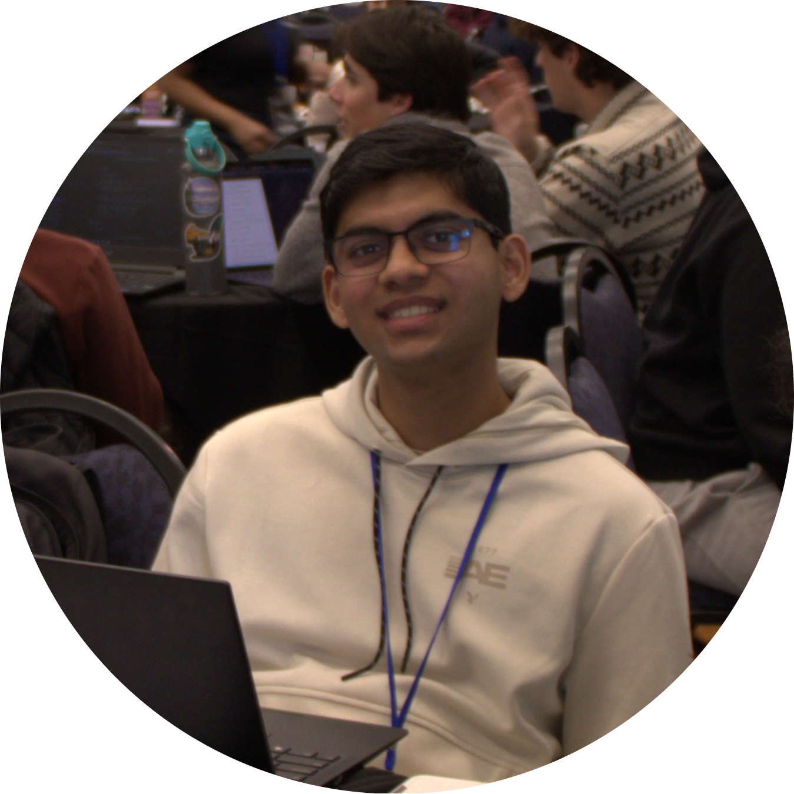

# Home

Hi there, hello! My name is Ved Pradhan, and I am a third-year student at UC Santa Barbara in the BS/MS program majoring in Computer Science. I am very passionate about cybersecurity and (post-)quantum cryptography, and I have multiple software engineering internships and CTF competition experiences under my belt (including winning the 2024 undergraduate division of iCTF!).

Outside of academics, I love playing board games and card games, reading mystery novels and spy thrillers, and listening to classical, cinematic, and barbershop music!

## Contact

- Personal Email: [vedprad1@gmail.com](mailto:vedprad1@gmail.com)
- School Email: [vpradhan@ucsb.edu](mailto:vpradhan@ucsb.edu)
- LinkedIn: [linkedin.com/in/ved-pradhan](https://linkedin.com/in/ved-pradhan)
- GitHub: [github.com/Ved-P](https://github.com/Ved-P)
