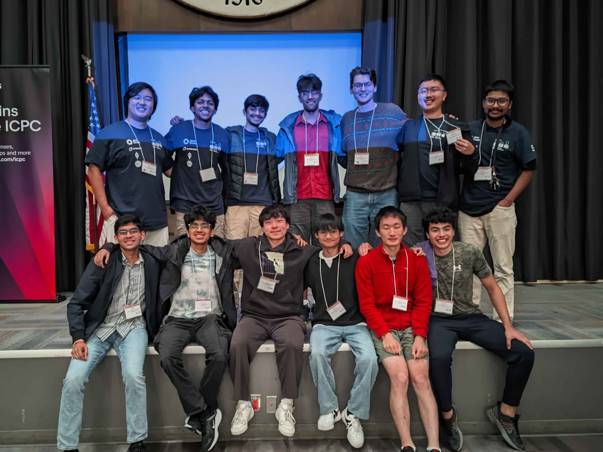

# Awards and Recognition

## International Capture the Flag (iCTF) Competition -- *1st Place*

*November 2024*

We won iCTF 2024!!! Our team, `hack_of_all_trades`, placed 1st out of 27 teams in an international, wide-area cybersecurity competition. I concentrated on developing exploits against prompt-based LLM tools and other similar AI integrated applications. I also placed 2nd out of 36 teams in 2023. Cheers to all of the other teams; you all put up a great fight!

## International Collegiate Programming Contest (ICPC) at UCSB -- *4th Place*

*October 2025*

We placed 4th out of 28 teams in the local edition of the International Collegiate Programming Contest (ICPC) at UCSB, a competitive programming competition. As a result of this, we qualified to represent UCSB at the ICPC Southern California Regionals at Riverside in November 2025, where we placed 26th out of 76 teams.

## picoCTF -- *176th Place*

*March 2025*

We placed 179th out of 10,460 teams in picoCTF 2025; at our peak, we were in the top 30. I specialized in solving the cryptography challenges while also tackling forensics, reverse engineering, and web exploits.
