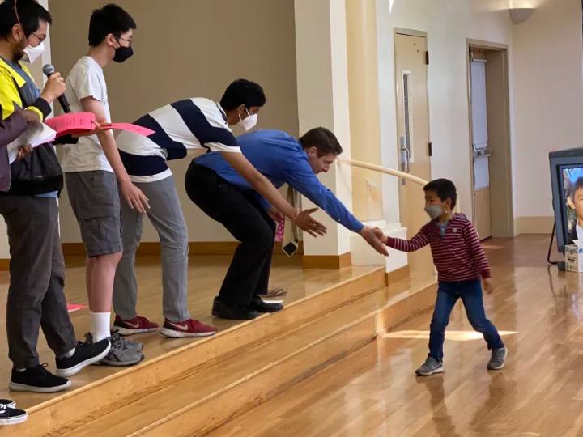

# Volunteering

## Harrison Chen Memorial Math Competition

*Since March 2020*

The Harrison Chen Memorial Math Competition, or HCMMC, is the best free math competition for elementary and middle schoolers (and adults!) in the Bay Area. After participating in HCMMC from 2016 to 2019, I wrote my first problem for the contest during March of 2020 in my capacity as a Teaching Assitant for Cupertino Math Olympiads. During my high school years, I continued to write HCMMC problems, and I also helped "holepoke" various contest divisions as well as proctor both in-person and online editions of the competition. In 2022, I served as one of the Lead Volunteers at the event, coordinating communication and organizing logistics among my fellow volunteers.

In June of 2024, my role at HCMMC was expanded, as I joined the executive board of organizers of the event. I began developing problems at a much higher rate than before, and I played a larger role in problem selection and contest curation. Since HCMMC 2025, I have assisted in large-scale event logistics, including coordinating registration across all divisions. Starting from HCMMC 2026, I plan on serving as a point person, which involves leading the contest activites and liaising between participants, parents, volunteers, and location staff during the day of the event. 

As of January 2026, I have written over 60 questions for HCMMC, and I continue to write with as much enthusiasm as I did six years ago! Writing HCMMC problems is more than just math; it is an art form, a medium of self-expression, and an outlet for creativity. I am eternally grateful for this opportunity, and I am excited for what's yet to come!

I also made the website for HCMMC! Check it out at [hcmmc-site.github.io](https://hcmmc-site.github.io).

## Other

- As a member of UCSB's COE Honors Program, I regularly volunteer in an around the UCSB community. I have assisted with registration at UCSB's career fairs, served as a proctor at UCSB's Science Olympiad tournament, helped lead arts and crafts activities at Isla Vista Elementary School fairs, and tutored fellow students in a program led by Tau Beta Pi at UCSB.
- While in high school, I volunteered with RemoteTA, helping elementary school teachers across the nation develop educational materials during and after the pandemic.
